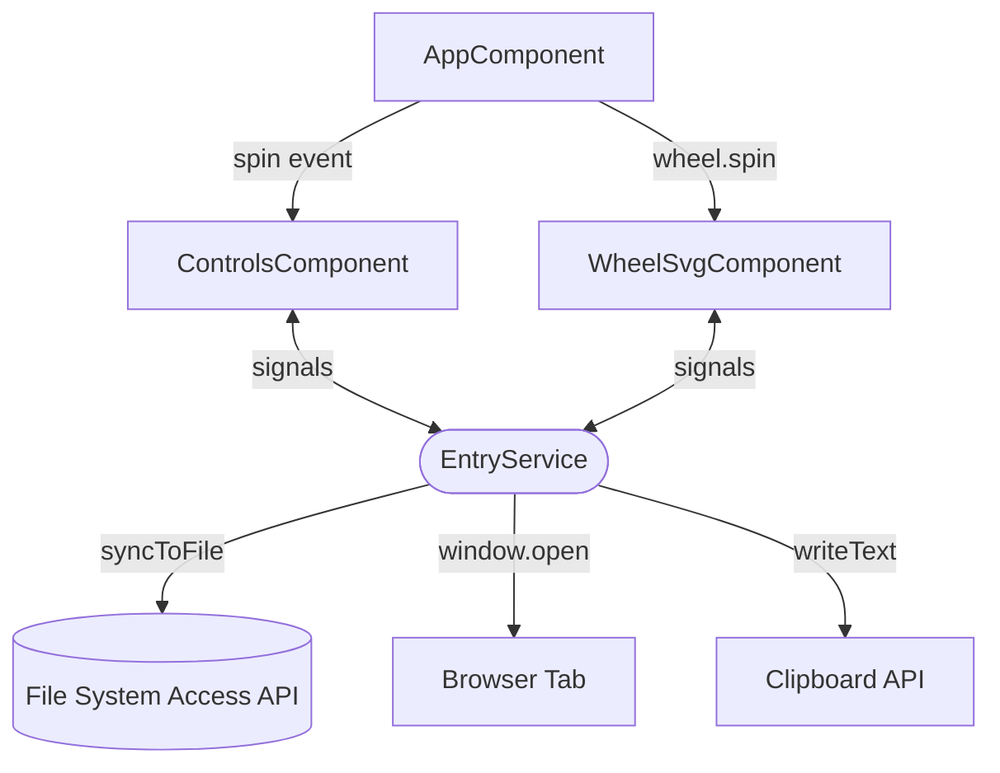
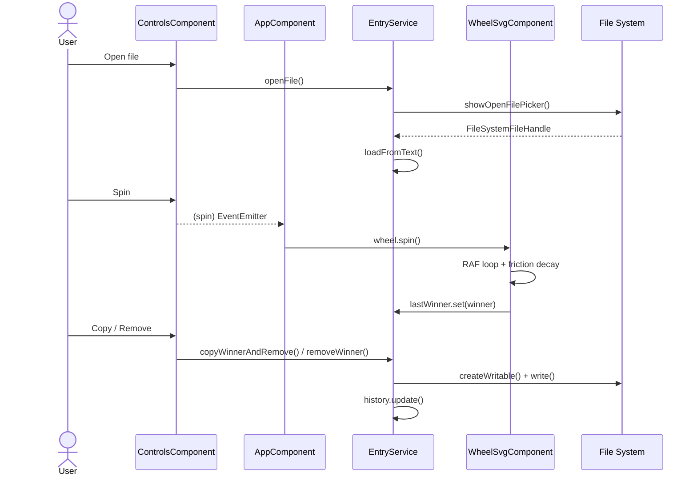

# ListWheel

A browser-based spin wheel that picks winners from any plain-text list. Load a `.txt` file, shuffle, and spin. The winner is highlighted on the wheel. URL entries open directly in a new tab; plain-text entries offer a Google Search shortcut or a simple remove.

Winners are progressively removed from the source file on disk in real time via the [File System Access API](https://developer.mozilla.org/en-US/docs/Web/API/File_System_API), so the pool stays in sync without re-uploading.

> **Live demo:** <https://luigiespinosa.github.io/list-wheel/>

## Highlights

- **Real-time file sync:** the original `.txt` file on disk is rewritten after every accepted result; closing and reopening the app picks up exactly where you left off.
- **Smart winner actions:** HTTP/HTTPS URLs open in a new tab; plain text shows a Google Search shortcut or a direct remove.
- **Adaptive rendering:** label density and font size scale with the entry count; pure SVG handles thousands of items with no canvas library.
- **Seeded shuffle:** Fisher-Yates algorithm with a Mulberry32 PRNG seeded from `crypto.getRandomValues`, making shuffles fast and cryptographically seeded.
- **Winner history:** timestamped, ordered log persisted for the session.
- **Signals-first state:** all shared state lives in `EntryService` as Angular signals; no NgRx, no `BehaviorSubject`, no manual subscriptions.

## Architecture

### Component tree



### Spin lifecycle



## Design

Dark-only UI built from a Sentry-inspired design system. All CSS variables are declared in `src/styles/tokens.css` and consumed component-side by name.

## Tech stack

| Concern        | Solution                                        |
| -------------- | ----------------------------------------------- |
| **Framework**  | Angular 20, standalone components.              |
| **Build**      | @angular/build (esbuild).                       |
| **State**      | signal, computed, effect.                       |
| **Rendering**  | Pure SVG.                                       |
| **File I/O**   | File System Access API.                         |
| **RNG**        | Mulberry32, seeded from crypto.getRandomValues. |
| **Testing**    | Karma + Jasmine + ChromeHeadless.               |
| **Deployment** | angular-cli-ghpages.                            |
| **Tokens**     | CSS variables in `src/styles/tokens.css`.       |

## Local development

```bash
npm install
npm start     # http://localhost:4200
npm test      # single headless Karma run

# WSL users: Karma needs a Chrome binary. Run this once, then restart your shell:

sudo apt-get install -y chromium
echo 'export CHROME_BIN=/usr/bin/chromium' >> ~/.bashrc
```

## Browser support

| Feature                 | Chrome / Edge 86+ | Firefox              | Safari               |
| ----------------------- | ----------------- | -------------------- | -------------------- |
| **Spin wheel**          | Yes               | Yes                  | Yes                  |
| **Real-time file sync** | Yes               | No (read-only input) | No (read-only input) |

## License

[MIT](https://opensource.org/license/mit)
